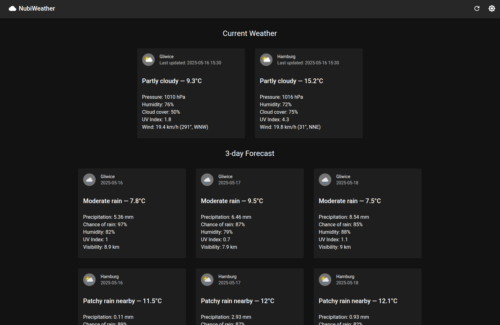

# Nubiweather Recruitment

A fullstack Next.js weather web app for Nubisoft recruitment exerecise.

This is a [Next.js](https://nextjs.org) project bootstrapped with [`create-next-app`](https://nextjs.org/docs/app/api-reference/cli/create-next-app).



The website shows current weather and a 3-day forecast for Gliwice and Hamburg. Web Application calls its own backend API to communicate with the external API server.

You can visit the website here: [https://weather.c2yz.com](https://weather.c2yz.com)

## Getting Started

To run the development server:

```bash
pnpm dev
```

Open [http://localhost:3000](http://localhost:3000) with your browser to see the result.

## Building

To build the production version:

```bash
pnpm build

# to run built version locally on localhost:3000
pnpm start
```

## API Routes

```
GET /api/realtime-weather ~ returns current weather for Glwice and Hamburg

GET /api/forecast-weather?days=%i ~ returns forecast for i number of days for Gliwice and Hamburg (days parameter defaults to 1)
```

## Frontend

Frontend has been built using NextJS and MUI framework.
